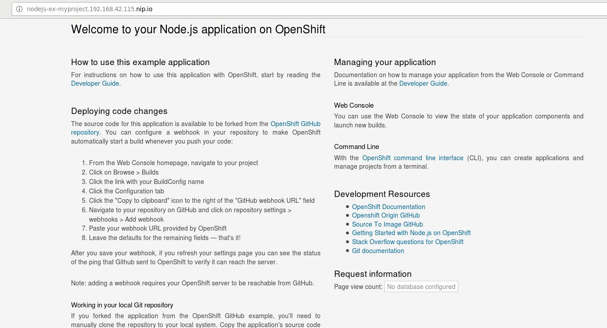

# Minishift Lab

## Overview

In this lab we will deploy a virtual machine and install minishift. Minishift will then use Docker and KVM to build a small virtual machine on which the OpenShift deployment will actually exist. Then we can use the minishift deployment to deploy various applications.

## Nested KVM

Typically Minishift would be run on a local computer, ie. a developers laptop. Instead of doing that, we will deploy Minishift to a virtual machine with nested KVM, as it will make it easier for everyone to complete this workshop. There are a few cloud providers which support nested virutalization, such as [GCP](https://cloud.google.com/compute/docs/instances/enable-nested-virtualization-vm-instances).

Nested KVM is not strictly needed, but without it the Minishift instance is likely to be quite slow.

*NOTE: This would not be needed if Minishift were running on a baremetal computer, which could be as simple as a laptop.*

## Create a Virtual Machine

If you are using this workshop as an individual, you will need a virtual machine to work in. Below we provide a couple of examples of building a virtual machine.

If this is part of a larger workshop, you will be provided with access to a virtual machine that has already been created for you.

### OpenStack

Create a a virtual machine in an OpenStack cloud with at least 8GB of memory. A floating IP will also be required, as well as the proper security groups to allow ports 22 (for ssh) and 6080 (for remote VNC access via a browser).

The following instructions presume networks, keypairs and other OpenStack settings or resources exist, enough to deploy a CentOS virtual machine.

*NOTE: This assumes nested virtualization is enabled in the OpenStack cloud, which is not always the case, and is not usually done by default.*

#### Security Groups

We **MUST** create a security group with at least two rules.

```
openstack security group create minishift
openstack security group rule create  --protocol tcp --dst-port 22 minishift
openstack security group rule create  --protocol tcp --dst-port 6080 minishift
```

#### Create Instance

Create the instance.

```
openstack server create \
--key-name default \
--flavor m1.medium \
--security-group minishift \
--nic net-id=minishift-network \
--image centos7 minishift
```

Above we have created a virtual machine of `m1.medium` size with a key name of `default` and on the network called `minishift-network`. Also it's based on a CentOS 7 image.

While that is building, we can create a floating IP to use.

#### Attach Floating IP

Create a floating IP and record the IP so that we can attach it to the minishift instance.

```
openstack floating ip create
```

Then we can attach that floating IP to the instance we just created.

```
openstack server add floating ip minishift <floating IP that was just created>
```

Now access the instance via ssh.

```
$ ssh centos@<floating ip>
```

### Google Compute

See the [nested KVM with GCP example](../general/nested-kvm-with-gcp.md).

If possible, please try to use a larger `machine-type` with GCP. The size tested for this workshop is `n1-standard-4`.

*NOTE: Ensure to login to the instance as the `centos` user, eg. `gcloud compute ssh centos@nested-kvm`.*

#### Add GCP Firewall/Security Group

Port 22 is open by default. Port 6080 will need to be allowed.

```
gcloud compute firewall-rules create \
allow-tcp-6080 \
--allow tcp:6080 \
--source-ranges=0.0.0.0/0 \
--description="allow port 6080 to all instances"
```

## Install the Minishift Command Line Application

First, we need `git`.

```
[centos@minishift ~]$ sudo yum install wget -y
```

Download the `minishift` command line application.

```
[centos@minishift ~]$ wget https://github.com/minishift/minishift/releases/download/v1.10.0/minishift-1.10.0-linux-amd64.tgz
```

Untar it.

```
[centos@minishift ~]$ tar zxvf minishift-1.10.0-linux-amd64.tgz
```

Move it to `/usr/local/bin`.

```
[centos@minishift ~]$ sudo cp minishift-1.10.0-linux-amd64/minishift /usr/local/bin
[centos@minishift ~]$ which minishift
/usr/local/sbin/minishift
```

Validate it is avaiable and working by checking the version.

```
[centos@minishift ~]$ minishift version
minishift v1.10.0+10461c6
```

## Install KVM

We need to install KVM in order for Docker Machine to be used by Minishift to deploy a small virtual machine.

First we validate that virtualization enhancements are available in the virtual machine (ie. nested virtualization).

```
[centos@minishift ~]$ grep -E '(vmx|svm)' /proc/cpuinfo
flags		: fpu vme de pse tsc msr pae mce cx8 apic sep mtrr pge mca cmov pat pse36 clflush mmx fxsr sse sse2 ss syscall nx pdpe1gb rdtscp lm constant_tsc rep_good nopl xtopology eagerfpu pni pclmulqdq vmx ssse3 cx16 pcid sse4_1 sse4_2 x2apic popcnt tsc_deadline_timer aes xsave avx hypervisor lahf_lm tpr_shadow vnmi flexpriority ept vpid xsaveopt arat
flags		: fpu vme de pse tsc msr pae mce cx8 apic sep mtrr pge mca cmov pat pse36 clflush mmx fxsr sse sse2 ss syscall nx pdpe1gb rdtscp lm constant_tsc rep_good nopl xtopology eagerfpu pni pclmulqdq vmx ssse3 cx16 pcid sse4_1 sse4_2 x2apic popcnt tsc_deadline_timer aes xsave avx hypervisor lahf_lm tpr_shadow vnmi flexpriority ept vpid xsaveopt arat
[centos@minishift ~]$ echo $?
0
```

Next install KVM and associated packages.

```
[centos@minishift ~]$ sudo yum install qemu-kvm qemu-img virt-manager libvirt libvirt-python libvirt-client virt-install virt-viewer bridge-utils -y
```

Add the Centos user to the libvirt group.

```
[centos@minishift ~]$ sudo usermod -a -G libvirt centos
```

Refresh groups for this particular terminal session.

*NOTE: If `newgrp` isn't working, simply logout and login again.*

```
[centos@minishift ~]$ newgrp libvirt
```

Startup and enable various services related to running KVM.

```
[centos@minishift ~]$ sudo systemctl enable virtlogd
[centos@minishift ~]$ sudo systemctl start libvirtd
[centos@minishift ~]$ sudo systemctl enable libvirtd
```

## Install Docker Machine

Minishift uses Docker Machine to create the Minishift instance.

Download Docker Machine:

```
[centos@minishift ~]$ sudo curl -L https://github.com/dhiltgen/docker-machine-kvm/releases/download/v0.7.0/docker-machine-driver-kvm -o /usr/local/bin/docker-machine-driver-kvm
```

Make it executable.

```
[centos@minishift ~]$ sudo chmod +x /usr/local/bin/docker-machine-driver-kvm
```

## Start Minishift

Now that Minishift, KVM, and Docker Machine have been installed, we can use Minishift to create a small OpenShift instance.

```
[centos@minishift ~]$ minishift start --memory 3GB
SNIP!
OpenShift server started.

The server is accessible via web console at:
    https://192.168.42.115:8443

You are logged in as:
    User:     developer
    Password: <any value>

To login as administrator:
    oc login -u system:admin
```

## Interact with Minishift

First we need to ensure we have access to the `oc` command line client.

Initially `oc` is not available on the command line though it is installed via `minishift`.

```
[centos@minishift ~]$ which oc
/usr/bin/which: no oc in (/usr/local/bin:/usr/bin:/usr/local/sbin:/usr/sbin:/home/centos/.local/bin:/home/centos/bin)
```

Using the `minishift` command line we can setup our terminal session with the correct path to find `oc`.

```
[centos@minishift ~]$ minishift oc-env
export PATH="/home/centos/.minishift/cache/oc/v3.6.0/linux:$PATH"
# Run this command to configure your shell:
# eval $(minishift oc-env)
[centos@minishift ~]$ eval $(minishift oc-env)
```

With our path correctly setup we can use the `oc` command line tool.

```
[centos@minishift ~]$ oc version
oc v3.6.0+c4dd4cf
kubernetes v1.6.1+5115d708d7
features: Basic-Auth GSSAPI Kerberos SPNEGO

Server https://192.168.42.115:8443
openshift v3.6.0+c4dd4cf
kubernetes v1.6.1+5115d708d7
```

Currently we are "logged into" OpenShift with the developer user. As we can see below, there are other contexts that could be used.

```
[centos@minishift ~]$ oc config get-contexts
CURRENT   NAME                                       CLUSTER               AUTHINFO                        NAMESPACE
          myproject/192-168-42-115:8443/developer    192-168-42-115:8443   developer/192-168-42-115:8443   myproject
          /192-168-42-115:8443/developer             192-168-42-115:8443   developer/192-168-42-115:8443   
          default/127-0-0-1:8443/system:admin        127-0-0-1:8443        system:admin/127-0-0-1:8443     default
          default/192-168-42-115:8443/system:admin   192-168-42-115:8443   system:admin/127-0-0-1:8443     default
*         minishift                                  192-168-42-115:8443   developer/192-168-42-115:8443   myproject
```

## Build a Graphical VNC Jump Host

We will be using a special Docker image to access the local OpenShift applications we deploy. This step has nothing to do with the actual Minishift deployment--it just makes it easier for us to deploy an existing Docker image that provides an HTML5 VNC instance for use to use for the purposes of the lab.

In short, we will use the Docker provided container as a "jump host" to be able to access the applications we deploy into the Minishift instance (which, somewhat confusingly, is actually a virtual machine running via nested KVM--we have both Docker and KVM running in the virutal machine).

### Install Docker

Install Docker.

```
[centos@minishift ~]$ sudo yum install -y docker
```

Start docker.

```
[centos@minishift ~]$ sudo systemctl enable docker
[centos@minishift ~]$ sudo systemctl start docker
[centos@minishift ~]$ sudo systemctl status docker
```

### Create a VNC Server in a Docker Instance

Start a Docker container that has a HTML5 VNC server running. The `ubuntu-desktop-lxde-vnc` image is has an HTML5 VNC server enabled. This will make it easier to access the various applications we will deploy to the Minishift/OpenShift system, and is not part of, or required for, Minishift.

*NOTE: The VNC instance is not using SSL, and should only be used in a temporary lab or worshop environment.*

*NOTE: Port 6080 must be opened in the security groups of the particular cloud or infrastructure being used.*

```
[centos@minishift ~]$ sudo docker run -d -p 6080:80 -e VNC_PASSWORD=coolpass dorowu/ubuntu-desktop-lxde-vnc
```

#### Access the VNC Application

Login to the VNC server by opening a browser session to the below, from your actual local computer, and use the password `coolpass` to login.

```
http://<floating IP>:6080
```

This VNC session will later be used to access any applications deployed into the minishift system.

## Deploy an Example Application

Back on the CentOS server we will deploy an example application.

First we need git.

```
[centos@minishift ~]$ sudo yum install git -y
```

Next, we will deploy the `nodejs-ex` example application.

```
[centos@minishift ~]$ oc new-app https://github.com/openshift/nodejs-ex -l name=myapp
--> Found image 09823a6 (5 days old) in image stream "openshift/nodejs" under tag "6" for "nodejs"

    Node.js 6
    ---------
    Node.js 6 available as docker container is a base platform for building and running various Node.js 6 applications and frameworks. Node.js is a platform built on Chrome's JavaScript runtime for easily building fast, scalable network applications. Node.js uses an event-driven, non-blocking I/O model that makes it lightweight and efficient, perfect for data-intensive real-time applications that run across distributed devices.

    Tags: builder, nodejs, nodejs6

    * The source repository appears to match: nodejs
    * A source build using source code from https://github.com/openshift/nodejs-ex will be created
      * The resulting image will be pushed to image stream "nodejs-ex:latest"
      * Use 'start-build' to trigger a new build
    * This image will be deployed in deployment config "nodejs-ex"
    * Port 8080/tcp will be load balanced by service "nodejs-ex"
      * Other containers can access this service through the hostname "nodejs-ex"

--> Creating resources with label name=myapp ...
    imagestream "nodejs-ex" created
    buildconfig "nodejs-ex" created
    deploymentconfig "nodejs-ex" created
    service "nodejs-ex" created
--> Success
    Build scheduled, use 'oc logs -f bc/nodejs-ex' to track its progress.
    Run 'oc status' to view your app.
```

It will take a couple of minutes for the application to be available.

```
[centos@minishift ~]$ oc status
In project My Project (myproject) on server https://192.168.42.115:8443

svc/nodejs-ex - 172.30.66.113:8080
  dc/nodejs-ex deploys istag/nodejs-ex:latest <-
    bc/nodejs-ex source builds https://github.com/openshift/nodejs-ex on openshift/nodejs:6
      build #1 running for 23 seconds - debf979: Merge pull request #156 from jim-minter/issue17649 (Ben Parees <bparees@users.noreply.github.com>)
    deployment #1 waiting on image or update

View details with 'oc describe <resource>/<name>' or list everything with 'oc get all'.
```

As can be seen above, the image is not quite available yet. Lets run status one more time.

```
[centos@minishift ~]$ oc status
In project My Project (myproject) on server https://192.168.42.115:8443

svc/nodejs-ex - 172.30.66.113:8080
  dc/nodejs-ex deploys istag/nodejs-ex:latest <-
    bc/nodejs-ex source builds https://github.com/openshift/nodejs-ex on openshift/nodejs:6
    deployment #1 deployed 46 seconds ago - 1 pod

View details with 'oc describe <resource>/<name>' or list everything with 'oc get all'.
```

Ok, now it has been deployed.

We can view the logs if we like.

```
[centos@minishift ~]$ oc logs -f bc/nodejs-ex
```

Expose the application.

```
[centos@minishift ~]$ oc expose svc/nodejs-ex
```

## Access the Deployed Application

First get the URL that OpenShift has deployed the application to.

*NOTE: The IP address in the URL will be different each time a new completed Minishift deployment is completed.*

```
[centos@minishift ~]$ minishift openshift service nodejs-ex -n myproject
|-----------|-----------|----------|--------------------------------------------------|--------|
| NAMESPACE |   NAME    | NODEPORT |                    ROUTE-URL                     | WEIGHT |
|-----------|-----------|----------|--------------------------------------------------|--------|
| myproject | nodejs-ex |          | http://nodejs-ex-myproject.192.168.42.115.nip.io |        |
|-----------|-----------|----------|--------------------------------------------------|--------|
```

[nip.io](http://nip.io/) is a "magic" domain name that will resolve the URL to the IP address `192.168.42.115`, whjich, in this example, is only available from the CentOS instance we are using.

```
[centos@minishift ~]$ dig +short nodejs-ex-myproject.192.168.42.115.nip.io
192.168.42.115
```

We can open that URL in the browser from inside the HTML VNC instance.

*NOTE: You will have to type in the entire URL into the browser URL bar from within the VNC browser session.*


